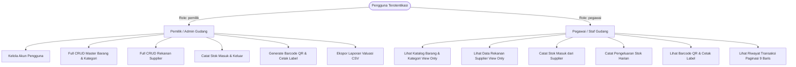
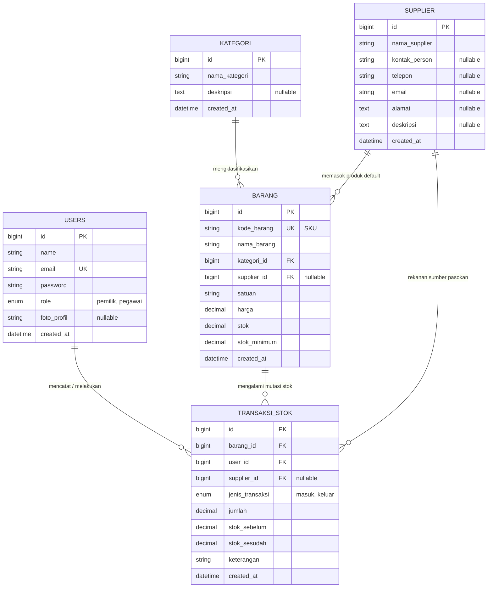
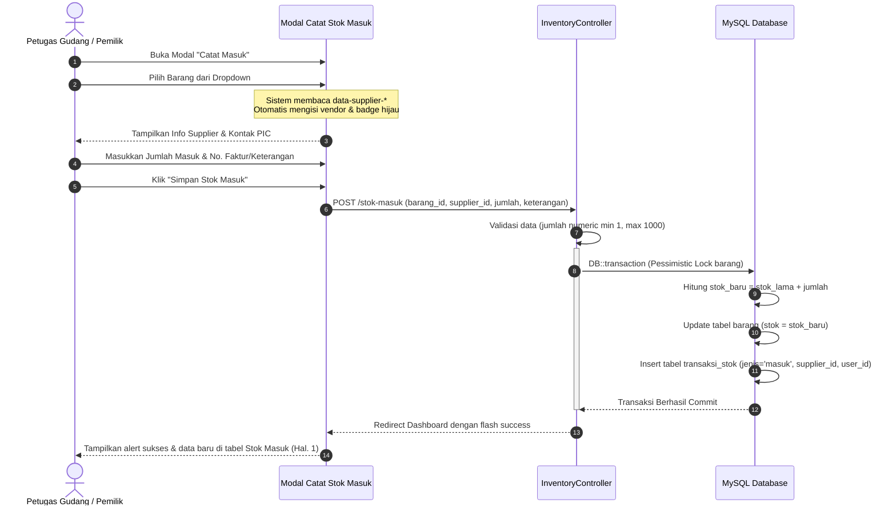

# Dokumentasi Bisnis Proses Sistem Manajemen Inventaris Gudang (StokClean)

Dokumentasi ini menyajikan panduan komprehensif mengenai arsitektur proses bisnis, peran pengguna (*roles*), alur operasional persediaan (*inventory workflow*), tata kelola relasi data, serta Standar Operasional Prosedur (SOP) pada aplikasi **StokClean**.

---

## 1. Pendahuluan & Gambaran Umum Sistem

### 1.1 Latar Belakang
**StokClean** adalah aplikasi manajemen inventaris pergudangan modern yang dikhususkan untuk pengelolaan persediaan alat, perlengkapan, dan bahan kimia sanitasi/kebersihan (misalnya cairan pembersih lantai, sabun cuci tangan, sapu, kain pel, lap microfiber, sarung tangan karet, dan disinfektan).

### 1.2 Tujuan Sistem
1. **Akurasi Stok Real-Time**: Mencegah selisih antara pencatatan pembukuan dan stok fisik di gudang.
2. **Pencegahan Kekosongan Stok (*Stockout*)**: Mendeteksi secara dini persediaan yang mencapai batas minimum (*safety stock*).
3. **Penyederhanaan Identifikasi Fisik**: Memberikan setiap item barang barcode kotak (QR Code) berbasis SKU unik yang dapat diunduh atau dicetak menjadi label fisik rak gudang.
4. **Keterlacakan Pasokan (*Traceability*)**: Menghubungkan setiap barang dan transaksi penerimaan stok masuk secara otomatis ke supplier rekanan.
5. **Pengendalian Distribusi**: Memastikan pengeluaran barang tercatat secara jelas tujuan penggunaannya dan tidak melebihi stok yang tersedia.
6. **Audit Trail yang Terorganisir**: Menampilkan log transaksi kronologis dengan sistem paginasi 9 baris per halaman untuk kemudahan verifikasi berkala tanpa penumpukan data.

---

## 2. Struktur Pengguna & Matriks Hak Akses (RBAC)

Sistem menerapkan prinsip *Role-Based Access Control* (RBAC) yang memisahkan tanggung jawab antara pemilik usaha/manajer gudang dan staf operasional.



### 2.1 Deskripsi Peran (Roles)
- **Pemilik (Admin)**: Memegang kendali manajerial dan kepemilikan data secara penuh. Bertanggung jawab atas pengelolaan katalog barang, penentuan batas minimum, penambahan kategori dan supplier baru, pengelolaan akun staf, serta evaluasi laporan valuasi aset.
- **Pegawai (Staf Gudang)**: Bertugas menjalankan operasional pergudangan harian, mencakup penerimaan barang masuk dari supplier (*inbound*) dan pencatatan distribusi barang keluar untuk kebutuhan fasilitas (*outbound*).

### 2.2 Matriks Hak Akses Fitur (CRUD & Action Matrix)

| Modul / Fitur | Pemilik (Admin) | Pegawai (Staf) | Aturan Bisnis & Batasan |
| :--- | :---: | :---: | :--- |
| **Login & Autentikasi** | Ya | Ya | Dilindungi Google reCAPTCHA v2 Checkbox |
| **Pengaturan Profil Diri** | Ya | Ya | Unggah foto profil (JPG/PNG maks 2MB), ubah password opsional |
| **Manajemen Pengguna** | Full CRUD | Ditolak (403) | Hanya pemilik yang dapat membuat akun staf/pemilik baru |
| **Master Data Barang** | Full CRUD | Lihat Saja | Pegawai tidak dapat menambah, mengedit harga/stok, atau menghapus |
| **Kategori Barang** | Full CRUD | Lihat Saja | Klasifikasi produk untuk pengelompokan |
| **Data Supplier & Vendor**| Full CRUD | Lihat Saja | Data kontak PIC, telp, email, alamat kantor rekanan |
| **Barcode Kotak (QR Code)**| Ya | Ya | Generate QR instan berbasis SKU, pratinjau, unduh PNG, cetak label |
| **Catat Stok Masuk** | Ya | Ya | Otomatis mendeteksi supplier barang, validasi jumlah masuk 1–1.000 |
| **Catat Stok Keluar** | Ya | Ya | Validasi stok cukup (tidak boleh minus), wajib isi keterangan |
| **Riwayat Transaksi** | Ya | Ya | Paginasi 9 item per halaman (1, 2, 3...) untuk masuk, keluar, dan riwayat |
| **Ekspor Laporan (CSV)** | Ya | Ya | Mengunduh file CSV nilai aset berformat UTF-8 BOM |

---

## 3. Arsitektur Entitas Data & Hubungan Relasi



---

## 4. Rincian Proses Bisnis Utama (Core Business Processes)

### BP-01: Otentikasi & Pengaturan Profil Pengguna
1. **Alur Masuk (Login)**:
   - Pengguna memasukkan alamat email dan kata sandi.
   - Pengguna wajib mencentang validasi Google reCAPTCHA v2 ("Saya bukan robot").
   - Sistem memverifikasi kredensial dan token reCAPTCHA ke Google API.
   - Jika valid, sesi dibuat dan pengguna diarahkan ke Dashboard sesuai peran.
2. **Manajemen Akun Staf (Khusus Pemilik)**:
   - Pemilik membuka tab **Pengguna** &rarr; klik **Tambah Pengguna Baru**.
   - Mengisi Nama, Email, Peran (*Pegawai* atau *Pemilik*), dan Sandi awal (min. 8 karakter).
3. **Pengaturan Profil Mandiri**:
   - Pengguna dapat memperbarui Nama, Email, dan Foto Profil (*Avatar*).
   - Validasi berkas foto profil ketat: hanya format `.jpg`, `.jpeg`, atau `.png` dengan ukuran berkas maksimal 2MB.
   - Bagian **Ubah Kata Sandi** bersifat opsional via *toggle switch*: kolom input kata sandi baru hanya aktif dan divalidasi apabila pengguna memilih untuk mengganti sandi.

---

### BP-02: Pengelolaan Rekanan & Vendor (Supplier Management)
1. **Pendaftaran Supplier**:
   - Pemilik membuka tab **Supplier** &rarr; klik **Tambah Supplier Baru**.
   - Memasukkan Nama Perusahaan/Toko, Nama PIC (Penanggung Jawab), Nomor Telepon/WhatsApp, Email, Alamat Gudang, dan Catatan Produk Pasokan.
2. **Katalog Kartu Supplier**:
   - Menampilkan kartu supplier dengan tautan interaktif `tel:` untuk panggilan langsung dan `mailto:` untuk surel penawaran.
   - Dilengkapi *badge* jumlah barang yang dipasok oleh supplier tersebut.
   - Fitur pencarian instan berdasarkan nama, kontak, atau alamat vendor.
3. **Integritas Penghapusan (Soft Disassociation)**:
   - Jika suatu supplier dihapus, barang-barang yang sebelumnya berelasi dengan supplier tersebut tidak ikut terhapus, melainkan kolom supplier pada barang terkait disetel menjadi kosong (`NULL`).

---

### BP-03: Manajemen Master Barang & Identifikasi Barcode QR Code
1. **Registrasi Barang Baru (Khusus Pemilik)**:
   - Pemilik mengisi Kode Barang (SKU unik, misal `BRG001`), Kategori, Nama Barang, Satuan (pcs, botol, pack, jerigen), Harga Satuan, Stok Minimum (*Reorder Point*), Supplier Default, dan Stok Awal Fisik.
   - Jika stok awal diisi > 0, sistem secara otomatis mencatat transaksi stok masuk perdana pada audit trail.
2. **Peringatan Stok Menipis (*Low Stock Warning*)**:
   - Sistem secara otomatis membandingkan `stok` dengan `stok_minimum`.
   - Jika `stok <= stok_minimum`, barang diberi label status kuning **Stok Menipis** dan dikelompokkan ke dalam daftar pantauan darurat pada Dashboard.
3. **Penerbitan Barcode Kotak (QR Code)**:
   - Setiap barang memiliki tombol akses cepat QR Code pada tabel katalog.
   - Kode QR di-generate secara instan di sisi peramban berbasis SKU unik barang tanpa bergantung pada API eksternal.
   - Pengguna dapat:
     - Mengunduh gambar QR beresolusi tinggi format `.png`.
     - Mencetak label stiker siap tempel (*Print Label*) lengkap dengan nama produk, SKU, satuan, dan estimasi harga untuk rak penyimpanan gudang.

---

### BP-04: Pengadaan & Pencatatan Stok Masuk (Inbound Logistics)

Proses ini menangani penambahan barang ke dalam gudang, baik pembelian rutin dari supplier maupun pengadaan barang baru.



**Aturan Bisnis Khusus Stok Masuk**:
- **Otomatisasi Supplier**: Saat barang dipilih pada dropdown, sistem secara otomatis mendeteksi supplier rekanan yang terhubung, menyetel nilai dropdown supplier, dan memunculkan kartu identitas supplier (Nama, PIC, Telepon) dengan status *badge* hijau **`Otomatis Terhubung`**.
- **Opsi Penggantian Fleksibel**: Apabila pada pengadaan tertentu pasokan didapat dari supplier alternatif, petugas dapat mengganti pilihan vendor secara manual dan status *badge* berubah menjadi biru **`Dipilih Manual`**.
- **Kapasitas Transaksi**: Jumlah masuk dibatasi antara 1 hingga 1.000 unit per transaksi untuk mencegah kesalahan ketik (*typo entry*).

---

### BP-05: Permintaan & Pengeluaran Stok Keluar (Outbound Logistics)

Proses ini mengatur pendistribusian alat dan produk kebersihan untuk kebutuhan operasional harian kantor, divisi kebersihan, atau gedung.

```mermaid
flowchart TD
    Start([Mulai: Kebutuhan Alat Kebersihan]) --> Input[Petugas Pilih Barang & Masukkan Jumlah Keluar]
    Input --> Keterangan[Wajib Isi Keterangan / Tujuan Penggunaan]
    Keterangan --> Submit[Kirim Form Pengeluaran Stok]
    Submit --> Lock[Kunci Baris Barang di Database (lockForUpdate)]
    Lock --> CheckStock{Apakah Stok Fisik >= Jumlah Keluar?}

    CheckStock -- Tidak --> Error[Tolak Transaksi: Rollback DB]
    Error --> Alert[Tampilkan Pesan Error: Stok Tidak Mencukupi]
    Alert --> EndFail([Selesai: Transaksi Batal])

    CheckStock -- Ya --> Deduct[stok_sesudah = stok_sebelum - jumlah]
    Deduct --> UpdateDB[Update Stok Barang & Simpan Log Transaksi Keluar]
    UpdateDB --> Commit[Commit Transaksi Database]
    Commit --> Success[Tampilkan Alert Sukses & Update Log Transaksi]
    Success --> CheckMin{Apakah stok_sesudah <= stok_minimum?}
    CheckMin -- Ya --> FlagLow[Tandai Status: Stok Menipis!]
    CheckMin -- Tidak --> FlagSafe[Status Tetap Aman]
    FlagLow --> EndSuccess([Selesai: Barang Berhasil Dikeluarkan])
    FlagSafe --> EndSuccess
```

**Aturan Bisnis Khusus Stok Keluar**:
- **Pencegahan Stok Minus (*Zero Deficit Guarantee*)**: Sistem menggunakan transaksi database dengan mekanisme *pessimistic locking* (`lockForUpdate`). Jika stok saat ini lebih kecil dari jumlah yang diminta, transaksi langsung digugurkan dan sistem memberikan peringatan detail sisa unit yang tersedia.
- **Akuntabilitas Pemakaian**: Kolom *Keterangan* wajib diisi (misal: "Operasional pembersihan toilet lantai 2" atau "Kebutuhan divisi housekeeping").

---

### BP-06: Audit Trail Transaksi dengan Paginasi 9 Baris

Untuk menjaga performa dan keterbacaan tampilan tabel saat catatan transaksi bertambah ribuan data:
1. **Pembagian Halaman Tepat 9 Baris**:
   - Tabel **Riwayat Stok Masuk**, **Riwayat Stok Keluar**, dan **Riwayat Seluruh Transaksi** membagi baris data menjadi tepat 9 baris per halaman.
2. **Navigasi Tombol Angka Halaman**:
   - Menampilkan bilah navigasi dengan tombol nomor halaman: `1`, `2`, `3`, dan seterusnya.
   - Disertai tombol `« Sebelumnya` dan `Selanjutnya »` yang otomatis nonaktif saat berada di batas awal atau akhir.
   - Halaman aktif ditandai dengan warna kontras (*dark slate*).
3. **Navigasi Single Page Application (SPA)**:
   - Perpindahan halaman terjadi seketika di sisi peramban (*client-side execution*) tanpa memicu *reload* halaman penuh, menjaga status tab navigasi tetap stabil.

---

### BP-07: Pelaporan & Valuasi Nilai Aset Gudang
1. **Perhitungan Valuasi Otomatis**:
   - Di tab **Laporan**, sistem mengalikan kuantitas stok fisik dengan harga satuan setiap item:
     $$\text{Nilai Aset Item} = \text{Stok} \times \text{Harga Satuan}$$
     $$\text{Total Nilai Aset Gudang} = \sum (\text{Stok}_i \times \text{Harga}_i)$$
2. **Ekspor Berkas CSV Terstandarisasi**:
   - Pengguna dapat mengunduh berkas rekapan `laporan-stokclean-YYYY-MM-DD.csv`.
   - Menggunakan header *UTF-8 Byte Order Mark* (BOM) sehingga saat dibuka langsung di Microsoft Excel, karakter khusus dan format angka tampil rapi tanpa *encoding error*.

---

## 5. Standar Operasional Prosedur (SOP) Gudang

### SOP-01: Penerimaan Barang Masuk (Restocking)
1. Petugas menerima surat jalan/faktur fisik dan fisik barang dari kurir/supplier.
2. Petugas memeriksa kondisi fisik barang, tanggal kedaluwarsa (untuk cairan kimia), dan kesesuaian jumlah.
3. Buka menu **Catat Masuk** pada sistem StokClean.
4. Pilih nama barang yang diterima. Periksa kartu supplier yang muncul secara otomatis. Pastikan nama vendor sesuai dengan surat jalan.
5. Masukkan kuantitas yang diterima pada kolom *Jumlah Masuk*.
6. Tuliskan nomor faktur/surat jalan pada kolom *Keterangan* (contoh: `Surat Jalan SJ-2026/09/112`).
7. Simpan transaksi, simpan barang ke rak penyimpanan gudang yang bertanda stiker QR Code barang tersebut.

### SOP-02: Pengeluaran Barang Operasional
1. Petugas menerima bon permintaan alat kebersihan dari staf kebersihan/divisi pemohon.
2. Buka menu **Catat Keluar** pada sistem StokClean.
3. Pilih barang yang diminta. Periksa apakah stok fisik mencukupi.
4. Masukkan jumlah unit yang diserahkan dan isi keterangan tujuan penggunaan secara spesifik.
5. Simpan transaksi pada sistem sebelum barang fisik diserahkan kepada pemohon.

### SOP-03: Tindak Lanjut Stok Menipis (Reorder Alert)
1. Setiap awal hari kerja, Pemilik/Kepala Gudang memeriksa *widget* **Peringatan Stok Menipis** pada Dashboard.
2. Untuk setiap item berstatus kuning, buka tab **Supplier** untuk melihat kontak PIC vendor pemasok barang tersebut.
3. Lakukan pemesanan ulang (*Purchase Order*) melalui nomor telepon atau email yang tertera pada kartu supplier.

---

## 6. Ringkasan Nilai Bisnis & Manfaat

| Parameter | Sebelum Menggunakan Sistem | Setelah Menggunakan StokClean |
| :--- | :--- | :--- |
| **Pencatatan Mutasi** | Buku manual / lembar kertas rawan hilang | Digital real-time terpusat berbasis database MySQL |
| **Kekosongan Stok** | Sering terjadi mendadak tanpa pemberitahuan | Peringatan dini otomatis saat stok mencapai batas minimum |
| **Identifikasi Barang** | Membaca kemasan satu per satu di rak | Penempelan label Barcode Kotak (QR Code) berbasis SKU |
| **Pelacakan Rekanan** | Mencari nota lama untuk kontak supplier | Supplier terhubung otomatis per barang dan transaksi |
| **Pengawasan Aset** | Menghitung kalkulator manual akhir bulan | Valuasi total aset dihitung otomatis dan dapat diekspor ke CSV |
| **Kerapian Data Log** | Tabel memanjang ribuan baris ke bawah | Rapi dengan paginasi modern 9 baris per halaman |
